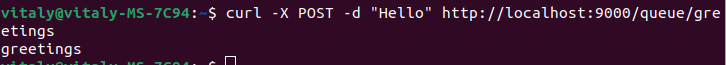
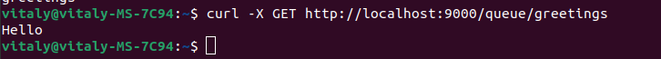
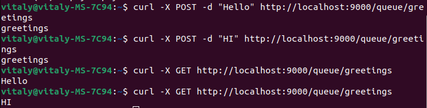
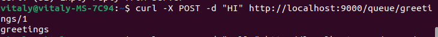
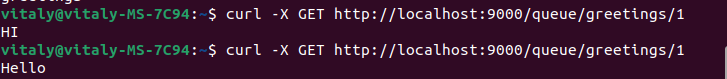
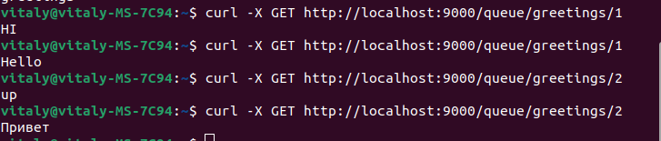

## Проект - Асинхронная очередь

Проект представляет собой сервер с системой обмена сообщений, построенной 
на базе потокобезопасных классов из Java Concurrency.
Клиенты могут иметь одну из ролей: отправители или получатели. В качестве клиента
будет выступать cURL, с использованием протоколов HTTP.
Система может работать в двух режимах
* Режим Очереди (Queue) - клиенты отправляют или получают сообщения из общей очереди
* Режим Заголовков (Topic) - каждый клиент имеет свою собственную очередь

### Используемые технологии 
* Socket
* Java Concurrency
* Java IO

### Требование к окружению 
* JDK 17
* cURL
* Maven

### Запуск проекта
1. Установить JDK 
2. Установить Maven 
3. Скачать проект с GitHub
4. Перейти в корень проекта и выполнить сборку проекта  
```shell
mvn package
```
5. После успешной сборки перейти в папку target и выполнить команду 
```shell
java -jar job4j_pooh-1.0-SNAPSHOT.jar
```

### Взаимодействие с проектом 
### Режим Queue
1. Для отправки сообщения необходимо в терминале отправить
   curl -X POST -d "${message}" http://localhost:9000/queue/${queue_name}

2. Для получения сообщения из общей очереди необходимо отправить
curl -X GET http://localhost:9000/queue/${queue_name}

3. Пример из нескольких сообщений

### Режим Topic
1. Для отправки сообщения необходимо в терминале отправить (в конце указав id)
curl -X POST -d "${message}" http://localhost:9000/queue/${topic}/${id}

2. Для получения сообщения из общей очереди необходимо отправить (в конце указав id)
curl -X GET http://localhost:9000/queue/${topic}/${id}

3. Пример для разных пользователей



### Контакты 
vithag97@mail.ru